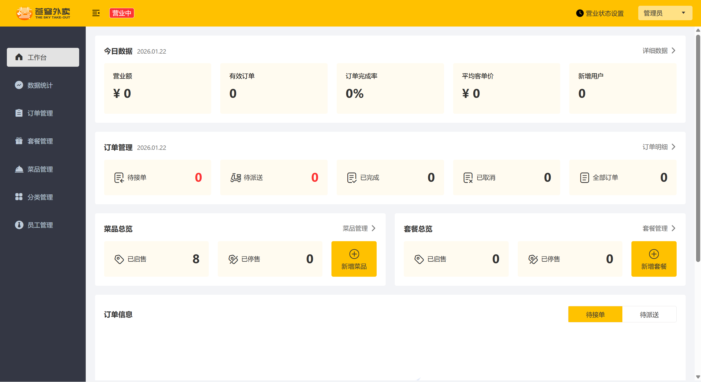
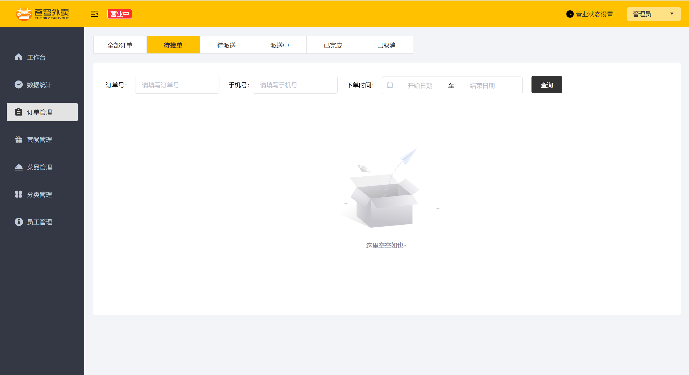
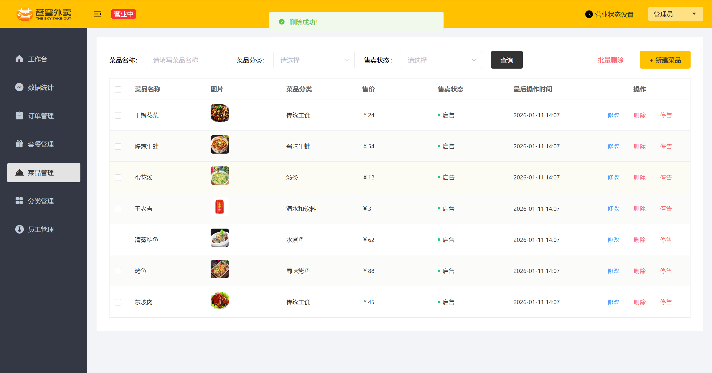

# 苍穹外卖 (Sky-Take-out) - 企业级O2O餐饮外卖系统

> **基于 Spring Boot + MyBatis + Redis + WebSocket 的全栈外卖订餐系统** 
> *不仅是作者的第一个练手项目，更是对高并发业务场景（如秒杀、超卖、分布式锁）的初步探索与实践。*

---

## 项目介绍

“苍穹外卖”是一个模仿美团/饿了么的**B2C 餐饮外卖系统**。项目包含**管理端 Web**（供商家使用）和**用户端小程序**（供消费者使用）两个子系统。

本项目不仅仅实现了基本的 CRUD，更着重于解决实际业务场景中的痛点，如：**订单状态流转、缓存一致性问题、高并发下的库存扣减、复杂报表统计**等。

### 核心业务流程
用户下单 -> 商家接单 -> 订单派送 -> 订单完成 -> 数据统计（形成闭环）。

---

## 功能展示

### 1.管理端 
*商家进行菜品管理、订单处理、数据报表查看的工作台。*

| 工作台数据看板 | 订单处理流程 | 菜品/套餐管理 |
| :---: | :---: | :---: |
|  |  |  |
| *今日数据概览 & 实时语音播报* | *接单/拒单/派送/完成* | *支持图片上传与口味配置* |

### 2. 用户端 
*C 端用户进行浏览、下单、支付的移动端界面。*

| &nbsp;&nbsp;&nbsp;&nbsp;&nbsp;&nbsp;&nbsp;&nbsp;&nbsp;点餐首页&nbsp;&nbsp;&nbsp;&nbsp;&nbsp;&nbsp; &nbsp;&nbsp;&nbsp;| &nbsp;&nbsp;&nbsp;&nbsp;&nbsp;&nbsp;&nbsp;购物车 & 结算&nbsp;&nbsp;&nbsp;&nbsp;&nbsp; &nbsp;&nbsp;| &nbsp;&nbsp;&nbsp;&nbsp;&nbsp;&nbsp;&nbsp;历史订单 &nbsp;&nbsp;&nbsp;&nbsp;&nbsp;&nbsp;&nbsp;&nbsp;| 

---

## 🛠️ 技术栈 

本项目采用前后端分离架构，后端采用标准的大厂开发规范。
### 前端技术 
* **核心框架：** Uni-app, Vue3, Element Plus
* **说明：** 本项目前端主要用于配合后端接口调试，不做深入维护。

### 后端技术

| 技术框架 | 说明 | 核心用途 |
| :--- | :--- | :--- |
| **Spring Boot** | 核心框架 | 快速构建项目，自动配置，RESTful API 开发 |
| **Spring MVC** | Web 框架 | 请求分发与处理，拦截器鉴权 |
| **MyBatis** | ORM 框架 | 数据持久化，动态 SQL 编写 |
| **Redis** | 缓存中间件 | **缓存菜品/套餐数据**（减少 DB 压力）、分布式锁（拓展项） |
| **Spring Cache** | 缓存抽象 | 基于注解（`@Cacheable`）实现声明式缓存开发，简化代码 |
| **Spring Task** | 定时任务 | 处理**定时清理无效订单**、每日凌晨数据结算 |
| **WebSocket** | 双向通信 | 实现商家端的**来单提醒**、**客户催单**语音播报 |
| **Apache POI** | Excel 处理 | 使用 `SXSSFWorkbook` 实现百万级数据的**流式导出**报表 |
| **JWT** | 登录校验 | 基于 Token 的用户身份认证与拦截器鉴权 |

### 环境依赖 (Environment)
* **JDK:** 8+
* **Database:** MySQL 5.7+
* **Cache:** Redis 5.0+
* **Tool:** IDEA, Navicat, Postman, Git

